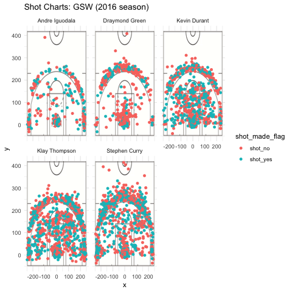

```{r setup, include=FALSE}
knitr::opts_chunk$set(echo = TRUE)
```

### Introduction


[source](http://thehoopdoctors.com/2018/11/which-record-could-the-golden-state-warriors-beat-this-season/)

Have you ever wondered how good the players on the Golden State Warriors team really are? How about how their shooting percentages compare to each other? If the answer is yes, this report is for you! This report will examine the shooting-related statistics of five Golden State Warrriors basketball players:  Stephen Curry, Kevin Durant, Draymond Green, Andre Iguodala, and Klay Thompson. Shot charts and tabular effective shooting percentage data will be used in the report to achieve this purpose.

---

### Background 

The data for this analysis was taken from [this database](https://github.com/ucb-stat133/stat133-hws/tree/master/data) located in the github repository for our Stat 133 class at UC Berkeley. The data is taken from the 2018 NBA season. The code for importing the data needed to complete the analysis in this final report is included below. For intermediate data processing steps, see [this repository]() on github created for the report.

```{r}
shots_data <- read.csv("../data/shots-data.csv", stringsAsFactors = F)
```

---

```{r, echo = F, message = F}
library(dplyr)
library(knitr)
```

### Data

This section of the report contains both the tabular shooting percentage data and shot charts for each player. Code and descriptions for each of the three data tables for shooting percentage are included above each table for reference.

---

##### Two Point Effective Shooting Percentage by Player

The data table below describes the percentage of 2-point field goals made by each player, arranged by percentage in decreasing order. A description of the data in each column is printed below.

Table Data:

* `name`: the name of the player
* `total`: the total number of 2-point shots attempted by the player
* `made`: the total number of 2-point shots successfully made by the player
* `perc_made`: the percent of 2-point shots made by the player (i.e. made/total)

```{r, comment = ""}
two_pt_effec <- arrange(summarize(group_by(filter(shots_data, shot_type == "2PT Field Goal"), name), 
          total = length(shot_type),
          made = sum(shot_made_flag == "shot_yes"),
          perc_made = (made / total) * 100),
        desc(perc_made))
```

```{r, comment = "", results = "asis", echo = F}
kable(two_pt_effec)
```


---

##### Three Point Effective Shooting Percentage by Player

The data table below describes the percentage of 3-point field goals made by each player, arranged by percentage in decreasing order. A description of the data in each column is printed below.

Table Data:

* `name`: the name of the player
* `total`: the total number of 3-point shots attempted by the player
* `made`: the total number of 3-point shots successfully made by the player
* `perc_made`: the percent of 3-point shots made by the player (i.e. made/total)

```{r, comment = ""}
three_pt_effec <- arrange(summarize(group_by(filter(shots_data, shot_type == "3PT Field Goal"),
                           name),
                           total = length(shot_type),
                           made = sum(shot_made_flag == "shot_yes"),
                           perc_made = (made / total) * 100),
                          desc(perc_made))
```

```{r, comment = "", results = "asis", echo = F}
kable(three_pt_effec)
```

---

##### Overall Effective Shooting Percentage by Player

The data table below describes the overall percentage of field goals made by each player, arranged by percentage in decreasing order. A description of the data in each column is printed below.

Table Data:

* `name`: the name of the player
* `total`: the total number of shots attempted by the player
* `made`: the total number of shots successfully made by the player
* `perc_made`: the percent of shots made by the player (i.e. made/total)

```{r}
overall_effec <- arrange(summarize(group_by(shots_data, name),
                           total = length(shot_type),
                           made = sum(shot_made_flag == "shot_yes"),
                           perc_made = (made / total) * 100),
                         desc(perc_made))
```

```{r, comment = "", results = "asis", echo = F}
kable(overall_effec)
```

---

##### Shot Charts by Player

The image below displays shot charts for each player in the report. Each shot chart shows the court location of every shot attempted by the player (using a point on the chart) as well as whether or not they made the shot (indicated by the color of the point on the chart). 

```{r echo = F, fig.align = "center", dpi = 300, out.height = "70%", out.width = "80%"}

```

---

### Analysis

After examining the data, a question that follows is who is the most effective player when it comes to shooting? However, this question does not have just one simple answer. One way to approach it is just by looking at the overall effective shooting percentages for each player. Based only on that data, Kevin Durant is the most effective shooting player, with his overall percentage at about 54.01%. However, by looking at the 2-point and 3-point specific data, results are different. The most effective 2-point shooting player is Andre Iguodala with a percentage of about 63.8%, and the most effective 3-point shooting player is Klay Thompson with a percentage of about 42.4%. While this analysis makes sense after looking at the data, it may be oversimplified and looking at the total column of each data table can lead to a more in-depth analysis. Some players in this report, like Stephen Curry and Klay Thompson, attempted way more shots than others which makes it harder for them to have a high percentage statistic since the percentage is calculated out of total shots attempted. Therefore, although Andre Iguodala's 2-point shooting percentage seems very high compared to that of the other players, he attempted significantly less shots making him have to make less shots than other players to achieve a high percentage. The shot charts included in the report confirm this observation visually, for it can be seen that some players have a lot more points on their chart than others. 

---

### Conclusion

The takeaway from this article is that shooting percentages of even the most successful Golden State Warrior players are not as high as what we may expect. These percentages are also not necessarily representative of the skill level of the players to which they belong. Using shooting percentages as data fails to include the factos of playing time, relative number of shots attempted, and possibly many others in an analysis of the shooting effectiveness of a given player. These percentages give us a piece of the overall picture, but not the whole thing.
